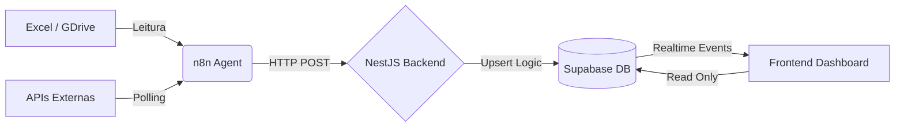

# Documentação Oficial — Banco de Dados

**Projeto:** Plataforma de Monitoramento Operacional & Indicadores  
**Baseado em:** PostgreSQL (Supabase) com Realtime + RLS

## 1️⃣ Visão Geral da Arquitetura de Dados

O banco de dados foi projetado seguindo os princípios:

*   **🔐 Secure by Default**: RLS (Row Level Security) ativo em todas as tabelas.
*   **🧩 Separação de domínios**: Operacional (Realtime) × Analítico (Histórico).
*   **🔁 Idempotência**: Prevenção de duplicação na ingestão.
*   **⚡ Realtime-first**: Arquitetura otimizada para frontend reativo.
*   **🧼 Fonte única de escrita**: Backend NestJS (Gateway).

### Componentes

*   **Supabase PostgreSQL**: Persistência + Realtime
*   **NestJS Backend**: Escrita, deduplicação e regras de negócio
*   **n8n**: Coleta, normalização e envio
*   **Frontend**: Apenas leitura (Consumidor)

---

## 2️⃣ Domínios de Dados

O banco é dividido em 2 domínios principais para evitar lock excessivo e garantir performance.

### 🧠 Domínio Operacional (Near Realtime)
Focado no "Agora". Dados quentes, atualizados a cada minuto.
*   Incidentes
*   Eventos
*   Monitoramento ativo

### 📊 Domínio Analítico (Histórico / Indicadores)
Focado em "Tendências". Dados frios/mornos, atualizados mensalmente ou sob demanda.
*   KPIs
*   Métricas mensais
*   Dados consolidados (Excel / BI)

---

## 3️⃣ Estrutura de Tabelas

### 🔹 3.1 `public.profiles`

Extensão da tabela de autenticação do Supabase (`auth.users`).

**Finalidade:**
*   Definir papel do usuário
*   Controlar permissões no frontend

| Campo | Tipo | Descrição |
| :--- | :--- | :--- |
| `id` | UUID | FK → `auth.users` |
| `email` | TEXT | Email do usuário |
| `role` | TEXT | `admin` / `operator` / `viewer` |
| `created_at` | TIMESTAMPTZ | Data de criação |

### 🔹 3.2 `public.incidents`

Tabela central de incidentes operacionais.

**Finalidade:**
*   Espelhar sistemas externos (Zabbix, SGO, GPON)
*   Alimentar dashboards em tempo real
*   Ser idempotente

**Chave Lógica (Unicidade):**
`(nm_origem, id_mostra)`

**Campos Principais:**

| Categoria | Campos |
| :--- | :--- |
| **Identificação** | `id` (UUID), `id_mostra`, `nm_origem` |
| **Status** | `nm_tipo`, `nm_status` |
| **Tempo** | `dh_inicio` |
| **Descrição** | `ds_sumario` |
| **Localização** | `nm_cidade`, `regional` |
| **Topologia** | `topologia`, `tp_topologia` |
| **Segmentação** | `grupo`, `cluster`, `subcluster` |
| **Categorização** | `nm_cat_prod2`, `nm_cat_prod3`, `nm_cat_oper2`, `nm_cat_oper3` |
| **Auditoria** | `payload` (JSONB), `created_at`, `updated_at` |

### 🔹 3.3 `public.incident_history`

Histórico imutável de mudanças de status.

**Finalidade:**
*   Auditoria
*   Cálculo de SLA Real
*   Linha do tempo (Timeline)

| Campo | Tipo | Descrição |
| :--- | :--- | :--- |
| `id` | UUID | PK |
| `incident_id` | UUID | FK → `incidents` |
| `old_status` | TEXT | Status anterior |
| `new_status` | TEXT | Novo status |
| `changed_at` | TIMESTAMPTZ | Momento da mudança |

### 🔹 3.4 `public.indicadores_residencial` (Novo)

Camada analítica de indicadores consolidados.

**Finalidade:**
*   Receber dados de Excel (Carga Historica)
*   Base para KPIs mensais
*   Dashboards históricos

**Granularidade:**
👉 1 linha por `período` + `região` + `cluster`

**Campos:**

| Categoria | Campos |
| :--- | :--- |
| **Período** | `referencia` (DATE) |
| **Dimensão** | `regional`, `cidade`, `cluster`, `subcluster` |
| **Clientes** | `clientes_base`, `clientes_afetados` |
| **Qualidade** | `disponibilidade`, `indisponibilidade` |
| **Atendimento** | `tma`, `tme` |
| **Chamados** | `chamados_abertos`, `chamados_fechados` |
| **SLA** | `sla` |
| **Auditoria** | `fonte`, `payload`, `created_at` |

**Constraint de Unicidade:**
`UNIQUE (referencia, regional, cidade, cluster, subcluster)`

---

## 4️⃣ Segurança (RLS – Row Level Security)

**Princípio Central:**
❌ Frontend **nunca** escreve nas tabelas principais.
✅ Backend é o único escritor autorizado.

### 🔐 Perfis e Incidentes

| Tabela | Operação | Quem |
| :--- | :--- | :--- |
| `profiles` | SELECT | Próprio usuário ou Admin |
| `incidents` | SELECT | Usuários autenticados |
| `incidents` | INSERT/UPDATE | `service_role` (Backend) |
| `incidents` | DELETE | ❌ Bloqueado (Apenas via Sync) |

### 🔐 Indicadores

| Tabela | Operação | Permissão |
| :--- | :--- | :--- |
| `indicadores_residencial` | SELECT | Todos autenticados |
| `indicadores_residencial` | INSERT | `service_role` |
| `indicadores_residencial` | UPDATE | `service_role` |
| `indicadores_residencial` | DELETE | ❌ Bloqueado |

---

## 5️⃣ Estratégia de Ingestão de Dados

### 🔁 Operacional (Incidents)
*   **Método:** Batch Upsert
*   **Chave:** `(nm_origem, id_mostra)`
*   **Histórico:** Automático via Backend
*   **Limpeza:** Full Sync (Deleta registros da origem que não vieram no lote atual)

### 📊 Analítico (Indicadores)
*   **Origem:** Upload de Excel no Google Drive
*   **Processo n8n:** Lê arquivo → Normaliza → Envia batch
*   **Backend:** Upsert mensal
*   **Retenção:** Append Only (Sem delete histórico)

---

## 6️⃣ Realtime

O Supabase Realtime está ativado nas seguintes tabelas para atualizações instantâneas no Frontend:
*   `incidents`
*   `indicadores_residencial`

**Uso no Frontend:**
*   Cards de KPI
*   Tabelas dinâmicas
*   Gráficos ao vivo
*   Alertas visuais

---

## 📊 Fluxo Final Consolidado

