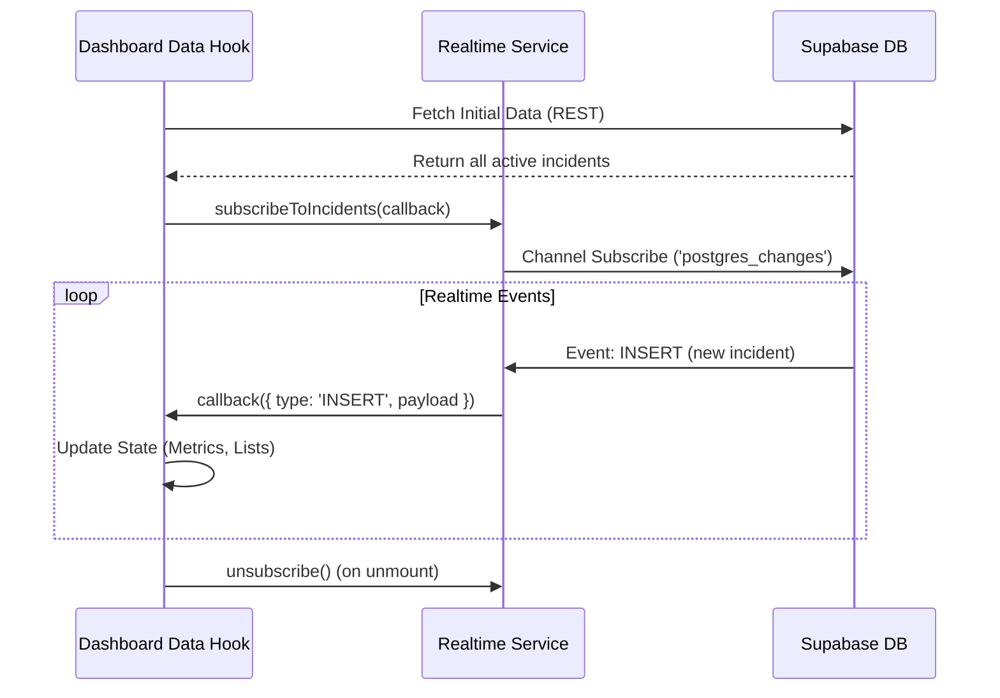

# Arquitetura Realtime (Supabase)

Esta documentação detalha a implementação do Supabase Realtime para sincronização de dados instantânea no Dashboard.

## Estratégia de Sincronização

A aplicação segue o padrão **"Initial Load + Delta Updates"**:

1.  **Carga Inicial**: Ao abrir o Dashboard, uma query REST padrão (`SELECT * FROM incidents`) busca o estado atual.
2.  **Assinatura (Subscription)**: O frontend se inscreve no canal de mudanças da tabela `incidents`.
3.  **Processamento de Deltas**:
    -   `INSERT`: Novo registro é adicionado ao estado local.
    -   `UPDATE`: Registro existente é atualizado no estado local.
    -   `DELETE`: Registro é removido (se aplicável).

## Service Layer (`RealtimeManager`)

O gerenciamento de conexões é isolado em `src/services/realtimeService.ts`.
Este serviço:
-   Evita múltiplas conexões duplicadas.
-   Gerencia o ciclo de vida do `supabase.channel`.
-   Fornece callbacks tipados para a UI.

## Fluxo de Dados

## Segurança

As atualizações Realtime respeitam as **Row Level Security (RLS)** policies definidas no banco. O usuário só recebe eventos de linhas que ele tem permissão de visualizar.
